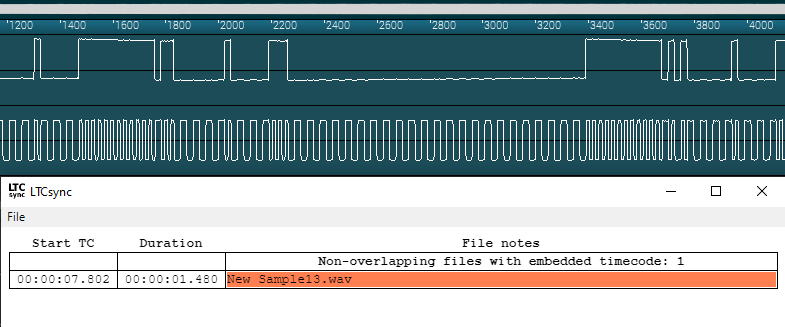

# Proof of Concept

Why am doing this? Primarily because it's a fun challenge. I've been interested in Timecode for a while
and the PIO blocks on the Pico make it very possible.

The `ltc_freerun.py` script is a proof-of-concept, and output a counting LTC stream. Connecting this to
PC audios input (via a resistor divider to reduce level), confirms that thei LTC content in the audio 
can be decoded.

In the following screen shot the top trace is the 'raw' bitstream, and the lower is the encoded LTC stream.

# Build Your Own

My intent is that the project could be used to build your own devices. The proof-of-concept can just be
dropped onto a 'bare-bones' Pico.

If you want a more fleshed out solution, you could look at [Buy A Pi](https://www.pishop.ca) (my 'go to'
supplier up here in Canada-land).

For example:
[Pico](https://www.pishop.ca/product/raspberry-pi-pico-h/)
[Display](https://www.pishop.ca/product/1-3inch-oled-display-module-for-raspberry-pi-pico-64-128-spi-i2c/)
[Charger](https://www.pishop.ca/product/lipo-shim-for-pico/)
[Battery](https://www.pishop.ca/product/lithium-ion-polymer-battery-3-7v-900mah/)

There needs to be some electronics to 'buffer' the audio signal in-to/out-from the Pico. My intent is to
create a small PCB to do this... 

# LTC Information

To find out more about the structure of the LTC packet:
[LTC Info](https://en.wikipedia.org/wiki/Linear_timecode)

I'll add documentation on the code as the project continues....
