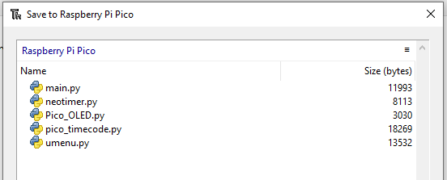
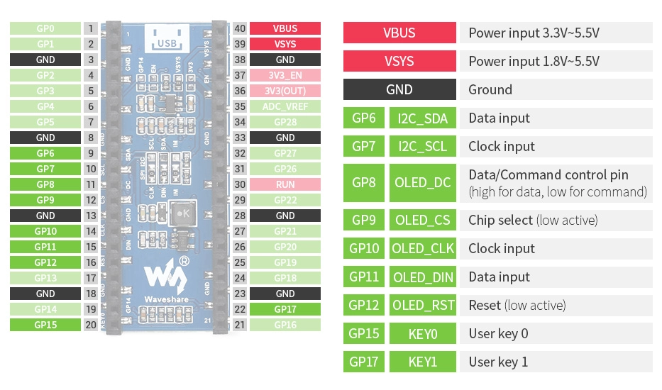
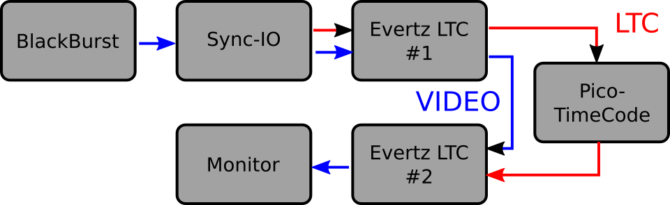
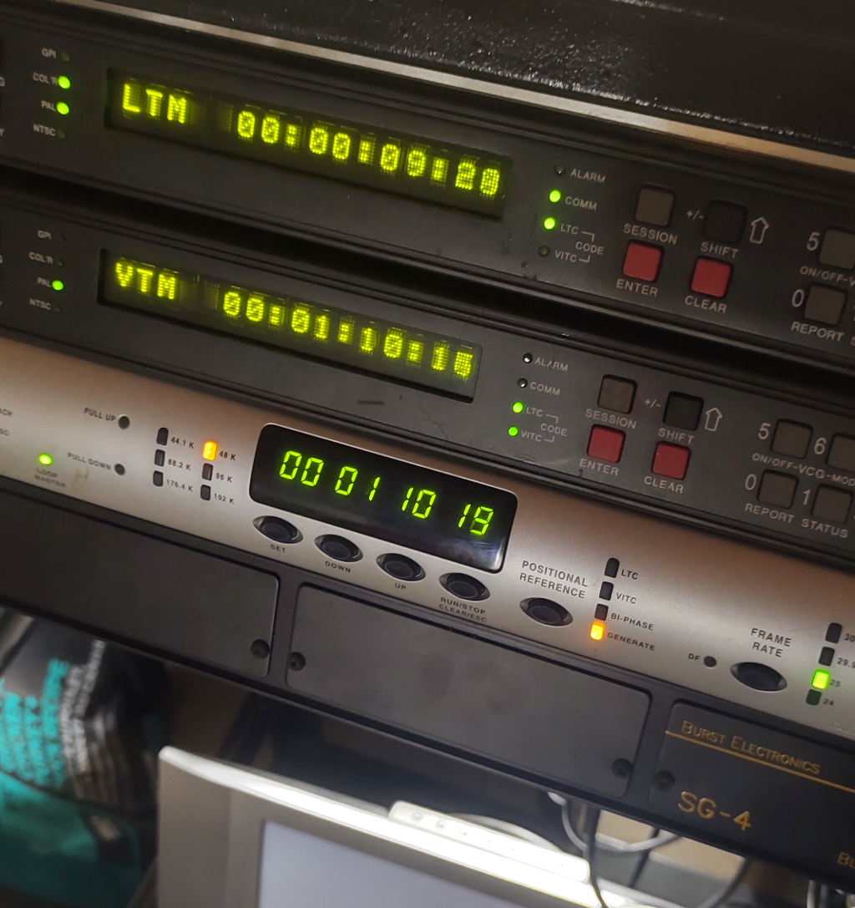

Why am doing this? Primarily because it's a fun challenge. I've been interested in Timecode for a while
and the PIO blocks on the Pico make it very possible...

# Now we're JAM'ing

We've moved past the Proof-of-concept stage! Well past....

I built up a couple of boards, with the Pico-OLED-1.3 display and was able to link LTC (at TTL levels)
between them. One board was configured to output, and the second was configured to Jam to incoming
LTC and then switch to outputing... and it worked.

[Demo Video](https://www.youtube.com/embed/T8Qv-cR-q_s)

Expect a new demo video soon... The script(s) now has a menu which can be used to control the device, 
and to navigate the settings. The incoming LTC is validated before Jam is performed, and the RX monitor
has indicator bar to show the relative timing between RX and TX.

This code is in four files; uploaded all four if you have the same hardware.

`Pico_LED.py` is library of screen functions, `umenu.py` is menuing library, `pico_timecode.py` and 
`main.py` combine to make the GUI app.



The `pico_timecode.py` script is also a self contained for use without a display, ie can be used on 
its own on a 'bare' Pico board.

In the following screen shot the top trace is the 'raw' bitstream, and the lower is the encoded 
LTC stream. We will need some interfacing hardware before the TTL level can be fed nicely into other 
hardware. 


# Build Your Own

My intent is that the project could be used to build your own devices. The proof-of-concept script(s) can 
just be dropped onto a 'bare-bones' Pico.

If you want a more fleshed out solution, you could look at ['PiShop'](https://www.pishop.ca) (my go-to
supplier up here in Canada-land).

For example:
[Pico](https://www.pishop.ca/product/raspberry-pi-pico-h/),
[Display](https://www.pishop.ca/product/1-3inch-oled-display-module-for-raspberry-pi-pico-64-128-spi-i2c/),
[Charger](https://www.pishop.ca/product/lipo-shim-for-pico/),
[Battery](https://www.pishop.ca/product/lithium-ion-polymer-battery-3-7v-900mah/)

There needs to be some electronics to 'buffer' the audio signal in-to/out-from the Pico. My intent is to
create a small PCB to do this. The above display is cheap and has both a SPI and I2C interface, it's
connections are as follows:



Which leaves the 'South' end of the Pico usable for LTC connections. My code uses separate PIO blocks and
each has it's own input/output pins. Once designed my LTC interface card will need to buffer audio and 
connect into the Pico.


If you do use my code for a personal project, drop me an email/picture.
If you make a device to sell, please send me an sample to test.

# How it works - PIO in detail

All of the LTC decoding is done in the PIO blocks, each has it's own task. Communincation
between the PIO is via their in/out pins, and with interrupts. 

The microPython script needs to monitor the FIFOs, to keep them feed or emptied.

```
    # Start-up/Trigger
    sm.append(rp2.StateMachine(0, start_from_pin, freq=sm_freq,
                               jmp_pin=machine.Pin(21)))        # Sync from RX LTC

    # TX State Machines
    sm.append(rp2.StateMachine(1, blink_led, freq=sm_freq,
                               set_base=machine.Pin(25)))       # LED on Pico board + GPIO26
    sm.append(rp2.StateMachine(2, buffer_out, freq=sm_freq,
                               out_base=machine.Pin(20)))       # Output of 'raw' bitstream
    sm.append(rp2.StateMachine(3, encode_dmc, freq=sm_freq,
                               jmp_pin=machine.Pin(20),
                               in_base=machine.Pin(13),         # same as pin as out
                               out_base=machine.Pin(13)))       # Encoded LTC Output

    # RX State Machines
    sm.append(rp2.StateMachine(4, decode_dmc, freq=sm_freq,
                               jmp_pin=machine.Pin(18),         # LTC Input ...
                               in_base=machine.Pin(18),         # ... from 'other' device
                               set_base=machine.Pin(19)))       # Decoded LTC Input
    sm.append(rp2.StateMachine(5, sync_and_read, freq=sm_freq,
                               jmp_pin=machine.Pin(19),
                               in_base=machine.Pin(19),
                               out_base=machine.Pin(21),
                               set_base=machine.Pin(21)))       # 'sync' from RX bitstream
```

## start_from_pin

Triggers start up, either automatically or from a pin. This sends IRQ to all of the TX
machines so that they start in unison. All of the PIO run at the same clock rate, which
(at preset) is 16x the LTC bit clock.

Although they run at the same clock speed, the RX machines are not nessecarily synchronised 
with the TX machines.

## blink_led

This loops precisely every frame, pushed values determine whether the LED blinks (for how
long) and the length of the loop. The very first cycle is slight longer to align blink with
start of frame - as we actually send Sync word before data.

## buffer_out

Data and Sync words are loaded by script via FIFO and machine plays out a 'raw' bit stream.

## encode_dmc

Takes the 'raw' bit stream and 'modulates' it into LTC stream (Differential Machester Encoding).

## decode_dmc

Receives the LTC stream (from the 'other device') and 'demodulates' it into a raw stream.
Uses a IRQ to signal the start of each bit, helping the reader keep sync.

## sync_and_read 

Takes the 'raw' bit stream, and processes in 2 halves... firstly uses a shift like arrangement
to clock the data into the ISR and then compares value with the Sync word. 

Value of Sync word is pre-loaded to Y via the FIFO. As the PIO does not have math functions, it 
**double-clocks** into the ISR, and can then use the `jmp(X != Y)` function to evaluate Sync word. 

When a Sync is found, it then clocks data portion into the ISR and pushes into the RX FIFO, as
two words. *It does not send Sync word to FIFO.*

It also sends a sync pulse on it's output pin, this is used to trigger the TX machine(s) when 
we are Jamming to received LTC.


# LTC Information

LTC is an audio signal, which contains information about the progression of time and some other
infomation. This signal helps synchronise multiple recordings, for example a multi-camera shoot could
record LTC on each camera and match together with a LTC audio track recorder on sound equipment.

Timecode can also be embedded in a video signal (VITC or HDMI Timecode), or as meta-data in audio 
(BWAV) files.

Technically Timecode can be run/scrubbed both backwards and forwards, but this project is only interested
in replicating an accurate clock, real-time in the forward direction.

To find out more about the structure of the LTC packet:
[Wikipedia](https://en.wikipedia.org/wiki/Linear_timecode)

## Note on accuracy/precision

The **whole** purpose of the time-code system it to be time precise, this is not normally something that
you'd expect from a Python script - let alone one running on a micro-controller.

The Pi Pico is different as it has a number of small (cycle precise) PIO engines. This code implements 
the LTC processing with multiple PIO engines. These each handle small chunks of the process and are 
synchronised with interupts between the PIO blocks.

The MicroPython script *only* needs to (pre-)compute the data for the LTC, and place it in a FIFO ahead of
when it is actually required. It will also run the 'UI', sending data to the screen and sensing buttons.

All the PIOs are set to clock at the same speed (16x LTC bit clock), whilst there may be some jitter 
in the clocks (due to fractional dividing) this should not be a problem.

The Pico is normally clocked from a 'cheap' 12.0MHz crystal. Whilst this may not be the 'worlds best' 
crystal, it can also be replaced with a better one if need be.

See: [https://github.com/dorsic/PicoPET](https://github.com/dorsic/PicoPET)


## So how good is it?

*Time will still tell...*

Given my interest (nee obsession) with TimeCode, I have already aquired some specialised test equipment. I
will measure the accuracy of the Pico modules and post results soon.

On the above 'first jam' video the two units started well in sync, but after ~20hrs it was clear that the
LEDs had drifted appart - by around 4 frames. This is still pretty good for a 'crappy' crystal. I will 
need to do some investigations as to whether this is coding error, or attributed to some other (fixable) 
issue. Otherwise we'll have to look at compensating somehow, or replacing the crystal with a better one. 

My approach will be to get the code to a point where it will 'Jam' to incoming LTC and then 'free-run' it's
output LTC. Using my test equipment I can monitor the LTC value from my source, as well as from the 
'Pico-Timecode' device.



Evertz #2 will also tell me the phase difference between the VITC (embedded in Video) and the LTC.


