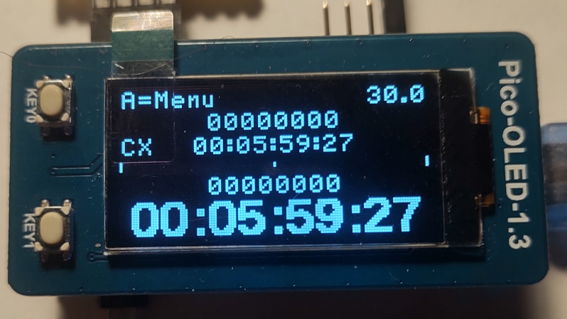

Why am doing this? Primarily because it's a fun challenge. I've been interested in Timecode for a while
and the PIO blocks on the Pico make it very possible...

# Now we're JAM'ing in the real world.

We've moved past the Proof-of-concept stage! Well past....

The project stalled in the summer, there was a scheduler bug in MicroPython which was causing
occassional lock-ups, and I couldn't figure it out.... anyhow they're smarter than me and the 
`RPI_PICO-20240105-v1.22.1.uf2` release works fine.

Mk-1 of the audio inteface is built, and I was able to Jam with the LTC from my Sync-IO, and feed
the regenerated LTC to an Evertz 5300 LTC Analyzer. After Jam the LTC is spot on, but (as expected)
'drifted off' as time went by.

I have designed the first revision of hardware, it's being fabricated and hopefully will be in
my hands soon. The [schematic](hardware/output/schematic.pdf) will show you how simple it is.

The code now contains a 'calibrate' mode, where the incoming RX LTC is monitored and the XTAL
frequencies are adjusted to match, these seems to work pretty well... but I am still working
with the passive/stock XTALs on the PICO.

Not yet looked at using a more precise/temp compensated XTAL...

[Demo Video - Rev 1](https://www.youtube.com/watch?v=2LLGX8mJC4A)

The `main.py` has a menu which can be used to control the device, and to navigate the settings. 
The incoming LTC is now validated before Jam is performed, and the RX monitor has indicator bar to 
show the relative timing between RX and TX.

This code is in five files; upload all seven if you have the same hardware.

`PicoOled13.py` is library of screen functions, `umenu.py` is menuing library, `neotimer.py` is timer
library, `pid.py` is a PID controller and `config.py` holds the settings for the unit.

`pico_timecode.py` and `main.py` combine to make the GUI app.

The first 5 are from other projects, which I use permissively under their own licenses:

- https://github.com/samveen/pico-oled-1.3-driver (*)
- https://github.com/plugowski/umenu
- https://github.com/jrullan/micropython_neotimer
- https://github.com/m-lundberg/simple-pid
- https://github.com/aleppax/upyftsconf

(*) actually using my port, as some changes are not yet accepted upstream

I created a sub-directory for the 'libs' to clarify that they are not really part of this project.

The `pico_timecode.py` script is also self contained for use without a display, ie can be used on 
its own on a 'bare' Pico board.

# Build Your Own

My intent is that the project could be used to build your own devices. The proof-of-concept script(s) can 
just be dropped onto a 'bare-bones' Pico.

There's some DIY suggestions [here](docs/DIY.md)

If you do use my code for a personal project, drop me an email/picture.
If you make a device to sell, please send me an sample to test.

# How it works

It's fair to say that this task should be far above a $3 MCU.

All of the LTC decoding is done in the PIO blocks, each has it's own task. Communincation
between the PIO is via their in/out pins, and with interrupts. 

The `pico_timecode.py` script just needs to monitor the FIFOs, to keep them feed or emptied.

The `main.py` forms the user interface/application, and controls the OLED screen

There's an indepth description on the workings [here](docs/how_it_works.md)

## So how good is it?

*Time will still tell...*

Given my interest (nee obsession) with TimeCode, I have already aquired some specialised test equipment.
I have also purchased an UltraSync One to use as a reference, and see how well Pico-Timecode can
interoperate.

My approach will be to get the code to a point where it will 'Jam' to incoming LTC and then 'free-run' it's
output LTC. The code itself has the ability to monitor the RX LTC, however the display is not fast enough
to display every frame (this does NOT affect the output though, as that's running from different core/thread).

For more details see [testing](docs/testing.md)

