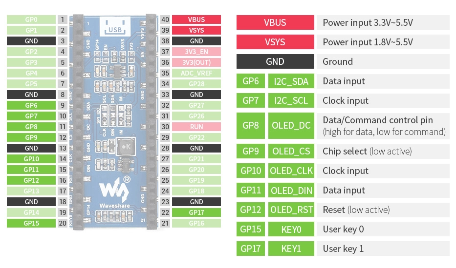

# Build Your Own

My intent is that the project could be used to build your own devices. The proof-of-concept script(s) can 
just be dropped onto a 'bare-bones' Pico.

If you want a more fleshed out solution, you could look at ['PiShop'](https://www.pishop.ca) (my go-to
supplier up here in Canada-land).

For example:
[Pico](https://www.pishop.ca/product/raspberry-pi-pico-h/),
[Display](https://www.pishop.ca/product/1-3inch-oled-display-module-for-raspberry-pi-pico-64-128-spi-i2c/),
[Charger](https://www.pishop.ca/product/lipo-shim-for-pico/),
[Battery](https://www.pishop.ca/product/lithium-ion-polymer-battery-3-7v-900mah/)

There needs to be some electronics to 'buffer' the audio signal in-to/out-from the Pico. My intent is to
create a small PCB to do this. The above display is cheap and has both a SPI and I2C interface, it's
connections are as follows:

Which leaves the 'South' end of the Pico usable for LTC connections. My code uses separate PIO blocks and
each has it's own input/output pins. Once designed my LTC interface card will need to buffer audio and 
connect into the Pico.

If you do use my code for a personal project, drop me an email/picture.
If you make a device to sell, please send me an sample to test.

