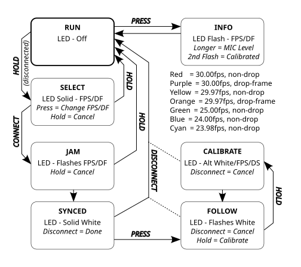

# The PT-Thrifty is the 'lowest cost Timecode'.

PT-Thrifty has a single 3.5mm jack, from power on this outputs LTC
timecode. At different times of operation the 3.5mm jack becomes an
input, so that the PT-Thrifty can be 'Jam-Synced' from another LTC 
device.

User interface is a single button and a RGB LED, with some actions
requiring connecting/dis-connecting the 3.5mm jack.

There is a 2nd LED next to the 3.5mm jack. This provides a 1PPS flash
from the internal LTC timers at the start of Frame-0. As this is driven
directly its timing is exact, but some commercial units (ie: UltraSync)
choose to blink on Frame-11 for some reason...

PT-Thifty is designed to be LOW COST, so does not include battery
or other features that are technically possible (although these can 
be DIY-ed). 

The unit needs to be (and remain) externally powered for the duration 
of the shoot.

[Video Demo](https://youtube.com/shorts/oo_elmEAXs4?feature=share)

# Map of the UI

In pictorial form the UI looks like:




## Run, and Info

When initially powered up, the PT-Thrifty will start outputing LTC
timecode - this is NOT schronized with anything, just a free running
clock/counter.

Upon power up the RGB LED will flash a colour to inform the user what 
FPS and DropFrame configuration is active:

Red 	= 30.00fps, non-drop
Purple	= 30.00fps, drop-frame
Yellow	= 29.97fps, non-drop
Orange	= 29.97fps, drop-frame
Green	= 25.00fps, non-drop
Blue	= 24.00fps, non-drop
Cyan	= 23.98fps, non-drop

At any time during 'Run' the user can press the button to be reminded
of the current configuration ('Info').

To 'Jam' to another unit, disconnect the 3.5mm jack and press-and-hold 
the button until the LED becomes a steady colour. Then connect the 3.5mm
jack from the 'Master LTC', the LED will flash the colour and then become
solid white when the 'Jam' is complete.

Note: once solid white is displayed the internal time is set, but the LTC 
is not output until the 3.5mm jack is disconnected, and then the connection 
to camera/recorder is remade. Then PT-Thrift will then output LTC.


## Output Level

PT-Thrifty has two output levels, 'High' (1V pk-pk) and 'Mic' (~80mV pk-pk).

In order to change the output level the unit must be power-cycled. The
output level is toggled 'High' <-> 'Mic' when the button is held during 
booting, and the current level is indicated during 'Info'.

The 'Info' flash is longer (0.3s vs 0.1) when the output level is 'Mic'.

Note: The 'Info' flash may be 2 flashes, this second flash indicates
that there is a calibrarion active for this fps. See below...


## Changing FPS and Drop-Frame configuration

As part of the 'Jam' process the FPS and Drop-Frame configuration can
be changed. From 'Run' hold the button until LED is solid colour, then
each press of the button will cycle through the available configurations.

When the desired configuration is reached, connect the 3.5mm jack to 
start jamming with the new configuration. This new configuration will be 
remembered for the next time PT-Thrifty powers on.

Note: During this 'Pre-Jam' selection, the internal LTC time is still
correct, if a user entered this state and changes their mind they can 
long-press the button to return to the 'Run' state. 

Note: Although the LED will cycle through configurations, a long-press 
'Cancel' will NOT affect the current configuration. 

Note: If the unit enters the 'Jam' mode (flashing Colour) then the 
internal LTC time is lost, and the unit will NOT be Synchronised until
it is Jam-Synced with external unit.


## Calibration

Typicaly the TCXO module inside PT-Thrifty is accurate to under +/-0.5
frames of drift over a 12 hour period.

However if the user has DIY-ed a board, they may be using the stock/passive
XTAL that the RP2040 boards normally have. This will be inaccurate, but
can be 'Callibrated' to match a more accurate source such as commercial
LTC device.

A calibrated DIY unit is only 'good' for a few hours, and is likely 
temperature dependant. If the user goes from a warm <-> cold ambient 
temperature, the LTC will drift from correct value.

Once the 'Jam' has completed, shown by solid white LED, a button press
will enter 'Follow' mode. During 'Follow' the LTC produced by PT-Thrifty
will be adjusted to match incoming LTC.

Disconnect the 3.5mm jack to return to 'Run' mode.

Note: as the LTC is not output at this time, this is just informative
and the relationship of RX vs. TX LTC will be relayed to the serial port.

A long-press will enter 'Calibration' mode, like 'Follow' the internal 
LTC rate will be steered to match incoming LTC. This is indicated with 
alternate White/Colour flashing.

After ~10mins of processing, the new calibration value will be stored and 
the unit will return to 'Follow' mode. Disconnect the 3.5mm jack to 
return to 'Run' mode.

Note: the 'Info' mode (button press from 'Run') will blink twice if 
there is an active calibration value for this FPS.

Note: To clear a calibration the user needs to enter 'Calibration' mode, 
but then disconnect the 3.5mm jack BEFORE it completes the calibration 
process.


## Debug

To assist debug, there is information output from the UART/Console.

In example below the 'unmodified' RP2040 is '3 / 640ths' of a frame
ahead of incoming RX LTC. As 'follow' is active PT-Thrity will adjust
its clock frequency/rate so that the offset becomes zero.

The 'bar-graph' shows a range of +/- 0.5 frames, it is only evaluating
the 'phase' of incoming LTC - it does not evaluate the LTC contents.

```
RX: 00:02:51:01 (  -3           :          ) (37.5, -150.75, -0.1)
RX: 00:02:52:03 (  -4           :          ) (37.5, -150.0, -0.0)
RX: 00:02:53:04 (  -4           :          ) (50.0, -149.0, 0.1)
RX: 00:02:54:06 (  -3           :          ) (50.0, -148.0, -0.0)
RX: 00:02:55:07 (  -3           :          ) (37.5, -147.25, -0.1)
RX: 00:02:56:09 (  -3           :          ) (37.5, -146.5, -0.0)
RX: 00:02:57:10 (  -3           :          ) (37.5, -145.0, -0.0)
RX: 00:02:58:11 (  -3           :          ) (37.5, -144.25, -0.0)
```

