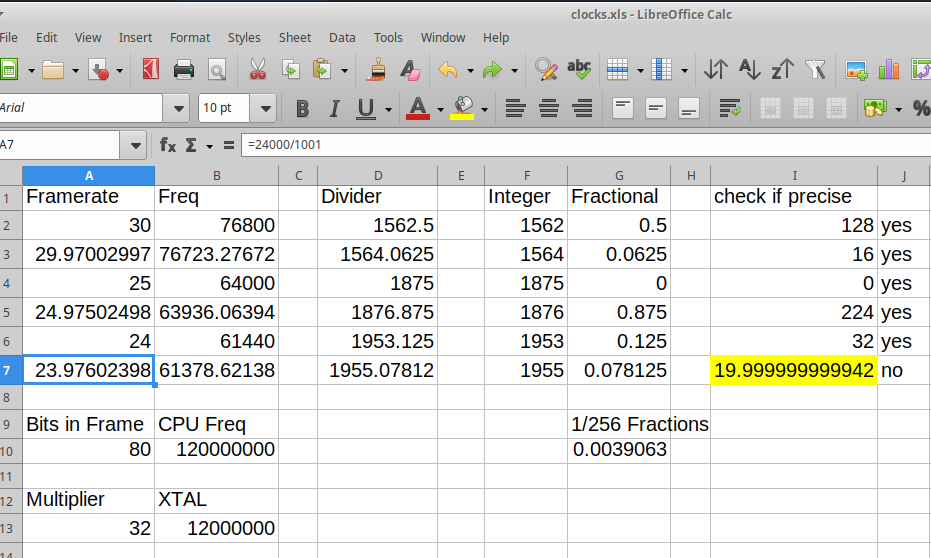
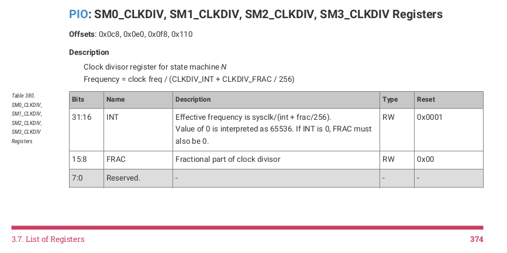
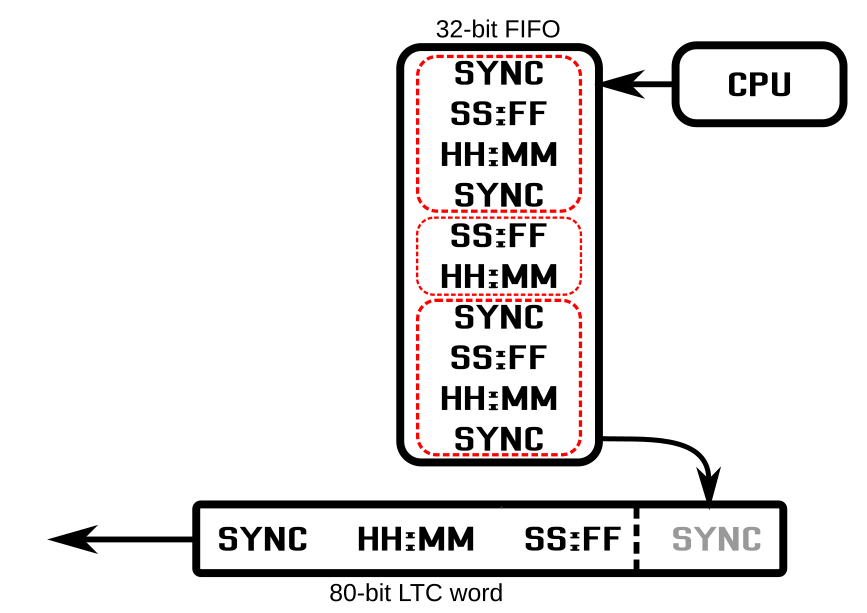

# How it works

All of the LTC de/encoding is done in the PIO blocks, each has it's own task.

[PIO blocks described in detail](PIO.md)

They are each clocked with the same clock (32 x LTC bit clock) which is derived from
the CPU clock (120MHz), which is turn is multiplied up from XTAL (12MHz).

## Clocks

The PICO is supplied 'stock' with a passive (non-temp compensated) XTAL of 12MHz. This
is multipled up (normally) to 133MHz.

For our purpose setting the CPU to 120MHz means that the required clocks for the PIO 
are easier to achieve.
```
$ python3 vcocalc.py 120
Requested: 120.0 MHz
Achieved: 120.0 MHz
REFDIV: 1
FBDIV: 120 (VCO = 1440.0 MHz)
PD1: 6
PD2: 2
```

From this 120MHz we actually want 32x LTC bit clock, 80 bits per frame which works out
as:


Since the divider value is not always integer, we rely on the fractional divider built 
into the PICO/PIO system. These are a 16-bit integer value, and a 8-bit fractional part.



As you can see we get a 'perfect' value for most (assuming XTAL is perfect), but for '23.98'
we have a slight inaccuracy. Given that the XTAL will not be perfect I believe that this
is acceptable

## FIFO

The LTC data is passed to the PIO blocks via their FIFO's ("First In, First Out" pipeline).

The microPython script needs to monitor the FIFOs, to keep them feed or emptied. As
the FIFO is 32bit wide, and the LTC 'word' is 80bits the CPU alternately loads either
2x 32-bit words, or 4x 32-bit words (with 2 SYNC's).



Since the FIFO is emptied by the PIO blocks, the loading process is NOT time critical.
The CPU just needs to ensure that the output (TX) FIFO is never emtpy, and that the input
(RX) is never full. An "Under-Flow" condition is triggered if that ever happens, and this
is a bad thing...

## Note on accuracy/precision

The **whole** purpose of the time-code system it to be time precise, this is not normally something that
you'd expect from a Python script - let alone one running on a micro-controller.

The newer code (with calibration) uses a correction factor for each FPS output, this determines
how many 'clicks' of the 'fraction divider' to offset by and then uses the 'float' part to
modulate between adjacent values (%duty in 10s period).

The Pico is normally clocked from a 'cheap' 12.0MHz crystal. Whilst this may not be the 'worlds best' 
crystal, it can also be replaced with a better one if need be.

See: [https://github.com/dorsic/PicoPET](https://github.com/dorsic/PicoPET)

If we need to use a different (say 12.8MHz, which I found some candadate parts), we will need
to reconfigure the CPU multipliers...
```
$ python3 vcocalc.py 120 --input 12.8
Requested: 120.0 MHz
Achieved: 120.0 MHz
REFDIV: 1
FBDIV: 75 (VCO = 960.0 MHz)
PD1: 4
PD2: 2
```

